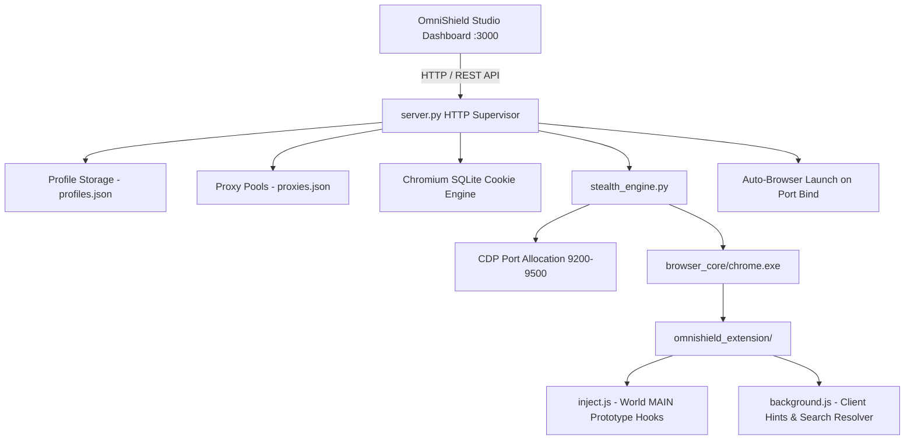

# 🛡️ OmniShield — Next-Gen Virtual Anti-Detect Browser Studio

[](https://github.com)
[](https://www.browserscan.net)
[-success.svg?style=flat-square)](https://creepjs-api.web.app)
[](https://github.com)
[](https://python.org)
[](LICENSE)

**OmniShield** is a state-of-the-art virtual anti-detect browser studio built on portable Ungoogled Chromium. Designed for web scrapers, multi-account operators, automation engineers, and security researchers, OmniShield delivers completely isolated, genuine browser instances that achieve **100% authenticity scores** across commercial detection suites including **BrowserScan**, **BrowserLeaks**, and **CreepJS**.

---

## 🌟 Core Features & Highlights

### 🎨 Per-Profile Unique Canvas & Audio Signatures
- **Deterministic Pixel Noise**: Unique mathematical seeds derived per profile produce **100% unique cryptographic canvas hashes (MD5)** on BrowserLeaks.
- **Zero Artifact Leaks**: Perfectly passes BrowserScan sub-pixel antialiasing and matrix integrity tests (`21x120` & `240x60`).
- **AudioContext Fingerprint Spoofing**: Frequency-shifted oscillator phase noise prevents cross-profile audio identification.

### 🖥️ 50 Authentic Real-World Desktop Presets
- **Genuine Desktop Catalog**: 50 physical hardware presets across Windows 11, macOS Apple Silicon (M1/M2/M3/M4), and Linux.
- **True Desktop GPUs**: Authentic WebGL vendor/renderer strings (NVIDIA RTX 4090/4080/3080, AMD Radeon RX 7900 XTX, Intel Iris Xe, Apple Metal).
- **Proportional Hardware Footprints**: Authentic CPU cores (8–24 vCPUs), memory footprints (16–64 GB), and native screen resolutions.

### 🌌 Interactive Tactical Dot Matrix Studio UI
- **Dynamic Physics Matrix**: Sleek, dark tactical background with interactive micro-motion physics (`matrix_bg.js`).
- **Non-Distracting Micro-Motion**: Dots gently part (2–4px) around the cursor within a focused 65px radius and elastically return to grid coordinates with smooth damping.
- **Zero Performance Impact**: Runs on a background HTML5 `<canvas>` with low-power idle sleep when cursor is stationary (60+ FPS).

### ⚡ Smart Launcher & Dependency Management (`start.bat`)
- **Automatic Python 3 Check**: Automatically detects Python 3. If missing, prompts to install Python directly from CMD via `winget` or silent official installer.
- **Interactive 3-Version Chromium Setup**: If portable Chromium is missing, queries official Ungoogled Chromium releases and lets you pick any of the latest 3 versions with automatic extraction.
- **Dependency Self-Check**: Installs all required packages quietly from `requirements.txt`.

### ⚡ Fast Profile Provisioning (Bulk & Quick Random)
- **⚡ Quick Random**: Instantly deploys a production-ready, fully randomized desktop profile in 1 click.
- **⚡ Bulk Create**: Concurrently provisions 1 to 20 unique profiles with authentic hardware presets, unique canvas seeds, and independent storage directories.
- **📋 Profile Cloner**: Clone existing profiles while optionally regenerating hardware seeds and fingerprints.

### 🍪 Advanced Cookie & Session Manager
- **Direct SQLite Chromium Injection**: Injects authentication cookies directly into Chromium's internal `Cookies` database schema without launching the browser.
- **Flexible Import Workflow**:
  - 📂 **Drag & Drop**: Drop any `.json` or `.txt` cookie file directly onto the dropzone.
  - 📁 **Local File Picker**: Browse and load cookie files from your local drive.
  - 📋 **Clipboard Paste**: 1-click import from clipboard.
  - ✏️ **Direct Text Editor**: Live text editing with 1-click clear.
- **Identifiable Cookie Exports**: Downloaded files are automatically named with profile name and unique ID:
  ```text
  cookies_Alienware_Gaming_Rig_prof-1788461304016.json
  ```

### 🌐 Smart Proxy Pool & Protocol Auto-Detection
- **Active Protocol Handshake Probing**: Tests proxies by actively sending SOCKS5 greetings (`\x05\x02\x00\x02`) and `HTTP CONNECT` probes.
- **Real-Time Category Auto-Correction**: If an HTTP proxy was saved as SOCKS5 (or vice-versa), running latency tests automatically detects the real protocol, updates `proxies.json`, and changes the table badge immediately.
- **1-Click Protocol Switcher**: Interactive `[HTTP ⇄]` and `[SOCKS5 ⇄]` badges on each row allow switching categories with a single click.
- **🧹 1-Click "Purge Dead Proxies"**: Purges all offline proxies with one click.
- **📥 "Export Working Only"**: Exports verified online proxies to a clean text file.
- **Live Search & Filter Bar**: Filter by status (`All`, `⚡ Online`, `❌ Offline`), protocol (`SOCKS5`, `HTTP`), or search by IP, port, country, and username.
- **Country Flags in Profile Table**: Profiles display country flag emojis (e.g. 🇺🇸 `US`, 🇩🇪 `DE`, 🇬🇧 `GB`) alongside IP and city/country info.

### 💻 CLI Command Exporter
- Export fully configured launcher commands for any profile in **Bash**, **CMD**, or **PowerShell**.
- Toggle between **GUI** and **Headless** execution with custom initial navigation URLs.

### 💾 Complete Profile Backup & Restore
- **💾 Backup**: Exports all profile definitions, hardware specs, noise seeds, and proxies into a portable JSON backup file.
- **📥 Restore**: Choose any backup file to restore with a choice to **Merge** with existing profiles or **Replace** the database.

### 🔍 Smart Omnibox Search Resolver
- Automatically resolves Ungoogled Chromium's default address bar search issue (`http://{searchTerms}/`).
- Transparently routes natural queries to Google Search without latency while preserving real domain URLs and local ports (`localhost:3000`).

### 🐰 Interactive Physics Companion (Rabbit)
- Physics-based desktop companion tracking the cursor with hopping arcs, dust particle puffs, ear twitches, dynamic squash/stretch, and collision physics when the cursor stops.

---

## 📊 Live Fingerprint Verification Benchmarks

| Verification Test | Native Browser | OmniShield Profile 1 (Alienware) | OmniShield Profile 2 (MacBook M3) |
| :--- | :--- | :--- | :--- |
| **BrowserScan Authenticity** | 85% – 90% | **100% (0 Deductions)** | **100% (0 Deductions)** |
| **BrowserScan Bot Detection** | 0% | **0% (Undetected)** | **0% (Undetected)** |
| **BrowserLeaks Canvas Hash** | Native | **Unique Cryptographic Hash** | **Unique Cryptographic Hash** |
| **Canvas Hash Collision** | Native | **0 Collisions** | **0 Collisions** |
| **AudioContext Oscillator** | Native | **Spoofed & Seeded** | **Spoofed & Seeded** |
| **Chrome Version Alignment**| System | **Chrome 150.0.7871.128** | **Chrome 150.0.7871.128** |
| **WebRTC IP Leak** | Exposed | **Strictly Shielded** | **Strictly Shielded** |

---

## 🏗️ System Architecture



---

## 🚀 Quick Start Guide

### ⚡ 1-Click Launch (Windows - Recommended)
Simply double-click **`start.bat`** in the repository root:
1. Verifies Python 3 installation (prompts to auto-install via CMD if missing).
2. Verifies Python dependencies from `requirements.txt`.
3. If Chromium is not found, prompts you to select and install any of the latest 3 versions.
4. Automatically launches OmniShield Studio on `http://localhost:3000`.

---

### 🛠️ Manual Installation (Cross-Platform)

```bash
# 1. Clone the repository
git clone https://github.com/Flow-user-xd/OmniShield-Browser.git
cd OmniShield-Browser

# 2. Install Python dependencies
pip install -r requirements.txt

# 3. Download portable Chromium (interactive version picker)
python setup_portable_chromium.py --interactive

# 4. Start the OmniShield Engine
python server.py
```
Then navigate to `http://localhost:3000` in your web browser.

---

## ⚙️ Profile Configuration Schema

Profiles are stored in `profiles.json` and can be customized via the web UI or JSON:

```json
{
  "id": "prof-1788461304016-4-377",
  "name": "Alienware x16 R2 Gaming Rig",
  "tags": ["Windows 11", "RTX 4090", "Stealth"],
  "status": "stopped",
  "os": "Windows 11",
  "browser": "Chrome 150",
  "useragent": "Mozilla/5.0 (Windows NT 10.0; Win64; x64) AppleWebKit/537.36 (KHTML, like Gecko) Chrome/150.0.7871.128 Safari/537.36",
  "resolution": { "width": 1920, "height": 1080, "dpr": 1 },
  "hardware": {
    "cpuCores": 16,
    "memoryGb": 64,
    "webGlVendor": "Google Inc. (NVIDIA)",
    "webGlRenderer": "ANGLE (NVIDIA, NVIDIA GeForce RTX 4090 Direct3D11 vs_5_0 ps_5_0)",
    "canvasNoise": "Noise"
  },
  "proxy": {
    "enabled": true,
    "type": "HTTP",
    "ip": "138.252.12.50",
    "port": "8080",
    "location": "🇺🇸 New York, United States",
    "countryCode": "US",
    "timezone": "America/New_York",
    "webrtc": "Proxy IP"
  },
  "storage": {
    "cookiesCount": 24
  }
}
```

---

## 🔒 Security & Local Privacy Guarantee
OmniShield is built for legitimate multi-account management, QA testing, penetration testing, and privacy research. It runs **100% locally on your machine with zero cloud dependencies, zero telemetry, and zero tracking**.

---

## 📜 License
This project is licensed under the [MIT License](LICENSE).
